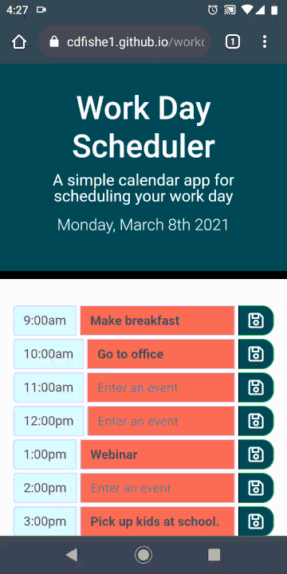

[](#license)


# Workday Scheduler

Provides a way to store inputed events in a daily scheduler.

## Table of Contents
* [Workday Scheduler](#javascript-quiz-screencast)
* [Deployment](#deployment)
* [Scope of Project](#scope-of-project)
* [Installation](#installation)
* [Code Highlight](#code-highlight)
* [Testing](#testing)
* [Credits](#credits)
* [License](#license)

## Workday Scheduler

### Screencast on mobile



## Deployment

Site deployed at [Charles Fisher](https://cdfishe1.github.io/workday-scheduler/)

## Scope of Project

* Used ES6 features such as const and let for variable declaration and arrow functions to enhance readability of the script.
* Used javascript to dynamically populate the contents of elements.
* Used dataset attributes to retrieve and manipulate output.
* Used nested for loops to populate attributes and retrieve local storage iteratively.
* Added title attributes to input fields to enhance accessibility.


## Installation

Deploy the html file and assets folder that contains the images, css, and javascript files on a website host server.

## Code Highlight

I used a jQuery method of targeting specific DOM elements.

```
// Sets the event listner and local storage on the save buttons
// I utilized the strategy found in the following stackoverflow answer: 
// https://stackoverflow.com/questions/8660269/getting-closest-input-value-from-clicked-element-with-jquery


buttonsArray.forEach((button) => {
    button.addEventListener('click', function() {
        let inputValue = $(this).closest("div.input-group").find("input").val();
        let timeKey = $(this).closest("div.input-group").find("input").attr("data-hour");
        localStorage.setItem(timeKey, inputValue);
 
    });

});

```

## Testing

Tested accessibility using [WAVE web accessbility evaluation tool](https://wave.webaim.org/report#/https://cdfishe1.github.io/workday-scheduler/)

* Generates 0 errors.

Generates 0 errors on load or through execution.

## Credits

* Natalie Finnegan, bootcamp participant, for helping me understand jQuery element selection.

## License

Copyright (c) Charles Fisher All rights reserved.<br>
Please be kind and change content if you wish to use this code.

<details><summary>Licensed under the MIT License</summary>

Copyright (c) 2021 - present | Charles Fisher

<blockquote>
Permission is hereby granted, free of charge, to any person obtaining a copy
of this software and associated documentation files (the "Software"), to deal
in the Software without restriction, including without limitation the rights
to use, copy, modify, merge, publish, distribute, sublicense, and/or sell
copies of the Software, and to permit persons to whom the Software is
furnished to do so, subject to the following conditions:

The above copyright notice and this permission notice shall be included in all
copies or substantial portions of the Software.

THE SOFTWARE IS PROVIDED "AS IS", WITHOUT WARRANTY OF ANY KIND, EXPRESS OR
IMPLIED, INCLUDING BUT NOT LIMITED TO THE WARRANTIES OF MERCHANTABILITY,
FITNESS FOR A PARTICULAR PURPOSE AND NONINFRINGEMENT. IN NO EVENT SHALL THE
AUTHORS OR COPYRIGHT HOLDERS BE LIABLE FOR ANY CLAIM, DAMAGES OR OTHER
LIABILITY, WHETHER IN AN ACTION OF CONTRACT, TORT OR OTHERWISE, ARISING FROM,
OUT OF OR IN CONNECTION WITH THE SOFTWARE OR THE USE OR OTHER DEALINGS IN THE
SOFTWARE.
</blockquote>
</details>


